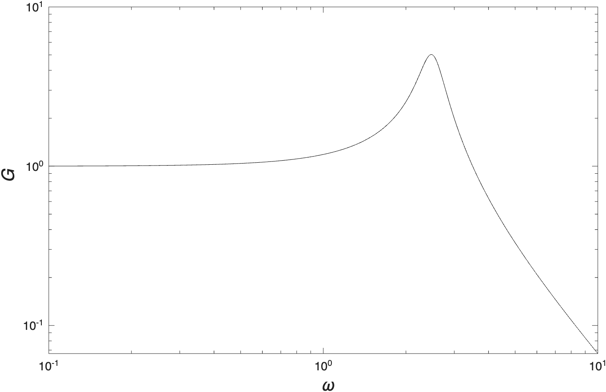

# MCEN 3030 Homework 4

This assignment will be auto-graded, but you have to tell GitHub to check your work. Within your repository, click on "Actions" towards the top, and on the left-hand side you should see "Click here to run grader". Then, you should see "Run workflow" to the right.

If you click on the most recent autograder run, you should be able to scroll down to see "Autograder Feedback". This will let you know what tests you have passed and (hopefully) give you some meaningful feedback about how to fix your code for the tests you have not passed. I encourage you to evaluate your own work before submitting, e.g.: make sure the array has the correct number of elements. 

## Problem 1

(a) Write a function ```golden_search(f,x_L,x_U,iter)``` that returns ```x_max```, the $x$-location of the maximum of a function $f$; ```f_max```, the maximum value of the function; and ```eb``` the error bound around that maximum point, i.e. the max is located at $x_\text{max}\pm\text{eb}$. The inputs are: ```f```, the anonymous one-dimensional function to be maximized; ```x_L``` and ```x_U```, the lower- and upper-bounds of the maximum search; and ```iter```, the number of iterations to run of the Golden Search.

(b) Check out [this video](https://youtu.be/RihcJR0zvfM?si=FiOdtZ4aMXDl9Xrj). You should see a helicopter whose blade speed lingers at the helicopter body's resonant frequency, leading to the helicopter shaking apart. (I think/hope they did this on purpose.) Mathematically, we could model this situation as a mass-spring-damper system, and the response function is

$$
G(\omega; \omega_n, \zeta) = \frac{\omega_n^2}{\sqrt{(\omega_n^2-\omega^2)^2+4\zeta^2\omega_n^2 \omega^2}}.
$$

Here $\omega$ is an input frequency (the blade rotation speed), $\omega_n$ is the natural frequency of the helicopter body, and $\zeta$ is the damping coefficient (a non-dimensional energy loss factor). For $\zeta=0.1$, $G$ looks something like this:



We see a pronounced peak with a value of about 6, which signifies a "gain" from input-to-output -- this is where the helicopter has "resonance", and what we need to be wary of if we want the helicopter to remain a helicopter instead of a scattering of helicopter parts!

Write a script ```freq_response``` that calls your Golden Search function to determine the $\omega$-location of the max of $G$ for $\omega_n=2.5$ and $\zeta=0.1\rightarrow 1$ in steps of $0.1$. Your max $\omega$ values should all be between $0$ and $5$. Use $20$ iterations for each search. Store the $\omega$-results in an array ```W_max```, and store the associated "gain" (the max value of $G$) in an array ```G_max```.

(You will learn more about this behavior system dynamics.)

## Problem 2

(a) Write a function ```steepest_ascent(f,grad_f,seed,step,con_accept,max_iter)``` that returns ```x_max```, an array of the maximum's coordinates; and ```f_max```, the value of the function at that location. The inputs are: ```f```, a scalar anonymous function with one array input; ```grad_f```, an anonymous function that produces an array output; ```seed```, a seed guess for the maximum's location; ```step```, the standard maximum size for your Golden Search; ```con_accept```, an acceptable convergence; and ```max_iter```, a cap on the number of iterations in case the search is diverging. You may hard-code ```20``` for the number of iterations in your Golden Search. For our convergence definition, we will use

$$
\text{con} = \sum_i \left| x_{i,\text{new}}-x_{i,\text{old}}\right|.
$$

(b) You have arrived at a best-fit equation

$$
y(x_1,x_2,x_3)=a_0+a_1x_1+a_2x_2+a_3x_3+\\
b_{11}x_1^2+b_{22}x_2^2+b_{33}x_3^2+
b_{13}x_1x_3
$$

which is obviously hard to visualize, unless you can think in four dimensions! Write a script ```SA_driver``` that uses steepest ascent to determine the maximum of this function. Use $(x_1,x_2,x_3)=(0.5,0.5,0.5)$ as the seed, and ```con_accept=0.001``` and ```max_iter=100```. Make sure to label your outputs in your script as ```x_max``` (an array) and ```y_max``` (a single value).

Important: You must include a copy of your ```golden_search``` function (.m, .py, or .jl) in both the problem_1 folder and problem_2 folder.

**See the course website for starter code.**


## Problem 3

(a) Write a function ```trapezoider(f,x_L,x_U,N)``` that returns ```A```, the area under the function ```f``` between ```x_L``` and ```x_U```, using ```N``` trapezoids. You may not use built-in integration tools but can use a built-in ```sum``` function. Hint: ```N``` trapezoids requires us to evaluate the function at ```N+1``` points.

(b) Thermal management for spacecraft is a significant engineering challenge as the only means of continuously removing heat is via radiation. Particularly as space flight becomes more comfortable and accessible (meaning more people, more electronics, more climate control), heat rejection schemes will necessarily become more important and complicated/creative. The "liquid drop radiator" is a proposed heat rejection scheme in which an oil is heated to $T_\text{initial}$ with waste heat and injected into space as a stream of drops. The drops radiate heat to space, decreasing their temperature to $T_\text{final}$ before being collected and reheated with additional waste heat. The process repeats.

The equation describing a drop's temperature is

$$
\frac{dT}{dt} = -c(1-F)T^4 - cF(T^4-T_\text{ship}^4)
$$

where $c$ is a constant related to material properties, $T_\text{ship}$ is the (constant) temperature of the spaceship's exterior, and $F$ is "the view factor" which is how much of the drop's view is occupied by the spaceship. This equation is separable:

$$
\frac{1}{-c(1-F)T^4 - cF(T^4-T_\text{ship}^4)} dT= dt
$$


and then we can integrate both sides of this equation to determine how long it takes for the drop to go from $T_\text{initial}$ to $T_\text{final}$.

Write a script called ```droplet_radiation``` that determines the time needed to cool the drop for values of ```F``` between $0$ and $1$, in steps of $0.05$. (So, you will determine 21 values for the cooling times.) Collect the results in an array called ```t_cool```. Use: 

$$
c=4.3\times 10^{-10}
$$

$$
T_\text{ship}=290
$$

$$
T_\text{initial}=500
$$

$$
T_\text{final}=300
$$

$$
N=100.
$$